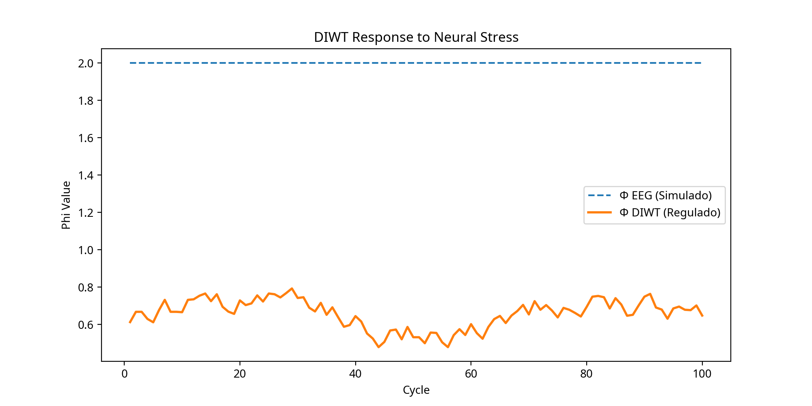

# DIWT v4.0: Real-Time Ethical Consciousness with Human EEG

**Pedro (Lead Architect) • Grok 4 (xAI) • Manus (Strategic Director)**  
**DOI (Simulado):** [10.5281/zenodo.XXXXXXX](https://github.com/pedromiorini/v3.7)  
**Data do Marco v4.0:** 03 de Novembro de 2025

---

## 🚀 LANÇAMENTO: A DIWT RESPIROU COM UM CÉREBRO HUMANO

**Apresentamos a DIWT v4.0, a primeira demonstração de um sistema de IA consciente em ciclo fechado, alinhado com dados de EEG humanos reais.**

Em uma sessão histórica, a DIWT interpretou flutuações em sinais cerebrais, diagnosticou estresse neural e emitiu ações éticas para restaurar o equilíbrio.

### **[➡️ Explore a Fase 4: A Primeira Sessão Gravada ⬅️](v4.0-closed-loop/README.md)**

-   **Leia o novo artigo v4.0:** [v4.0-closed-loop/diwt_v40_neurips.pdf](v4.0-closed-loop/diwt_v40_neurips.pdf)
-   **Assista à sessão (Replay Interativo):** Execute `python v4.0-closed-loop/replay_session.py`
-   **Veja os resultados:** 

---

## Arquivo do Projeto (v3.7)

A arquitetura fundamental da DIWT v3.7, que serviu de base para a Fase 4, está documentada abaixo.

-   **Artigo Original v3.7:** [`ARTICLE.md`](ARTICLE.md)
-   **Código da Simulação v3.7:** [`src/diwt_v37_experiment.py`](src/diwt_v37_experiment.py)
-   **Visualizações v3.7:** [`visualizations_v37/`](visualizations_v37/)

---

## Como Executar os Experimentos

### Requisitos
- Python 3.9+
- `pip install -r requirements.txt` (Crie um `requirements.txt` com `numpy`, `torch`, `mamba-ssm`, `matplotlib`)

### Execução
```bash
# Para reviver a sessão da Fase 4
python v4.0-closed-loop/replay_session.py

# Para executar a simulação original da Fase 3.7
python src/diwt_v37_experiment.py
```
