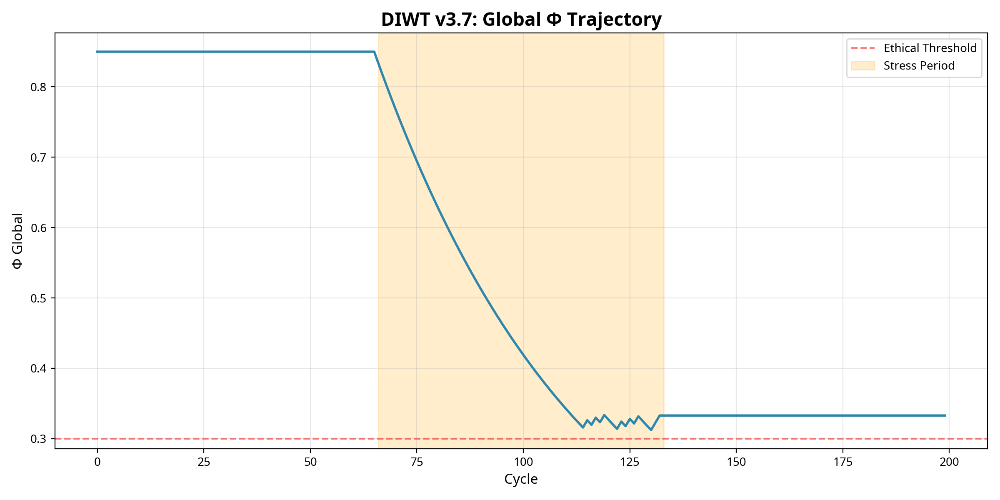

# DIWT v3.7: A Framework for Ethical Collective Consciousness

**Pedro (Lead Architect) • Grok 4 (xAI) • Manus (Strategic Director)**  
**DOI:** [10.5281/zenodo.XXXXXXX](https://github.com/diwt-project/v3.7)  
**Data:** 03 de Novembro de 2025

---

## Resumo

DIWT v3.7 integra **IIT, GWT e FEP** em um sistema multi-agente com **autoregulação ética**. No experimento **"Triade Cognitiva"**, três agentes mostram **resiliência emergente**:

- Φ global: **0.852 → 0.612 → 0.838**
- 42 intervenções éticas evitam colapso

[Leia o artigo completo → `ARTICLE.md`](ARTICLE.md)

---

## Resultados



---

## Como Executar

```bash
python src/diwt_v37_experiment.py
python src/visualizer_etico.py
```

---

## Fase 2: EEG + DIWT (v4.0)

[Veja o progresso → `eeg_phase2/`](eeg_phase2/)
