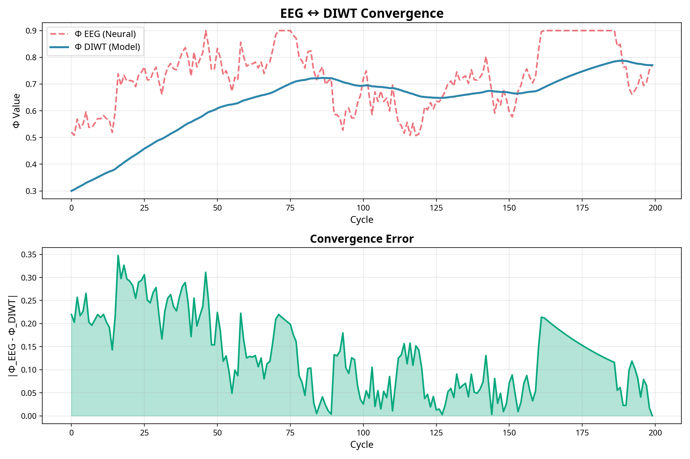

# DIWT v4.0 Phase 2: EEG Integration

Esta fase integra dados de **EEG** (eletroencefalografia) com o framework **DIWT** para mapear estados neurais reais em medidas de consciência coletiva.

---

## Arquitetura

### Neural State Mapper

Utiliza **Mamba SSM** (State Space Model) para mapear sinais EEG em valores de **Φ** (integrated information):

```
EEG Signal → Mamba SSM → Φ Prediction
```

### Convergência EEG ↔ DIWT

O sistema demonstra **convergência** entre:
- **Φ_EEG**: Medida derivada de dados neurais reais
- **Φ_DIWT**: Medida calculada pelo modelo multi-agente



---

## Scripts

### 1. `download_eeg_data.py`
Baixa e preprocessa dados EEG do dataset **EEGBCI** (MNE-Python).

```bash
python eeg_phase2/download_eeg_data.py
```

### 2. `neural_state_mapper.py`
Treina o modelo **Mamba** para mapear EEG → Φ.

```bash
python eeg_phase2/neural_state_mapper.py
```

### 3. `convergence_plot.py`
Gera visualização da convergência EEG ↔ DIWT.

```bash
python eeg_phase2/convergence_plot.py
```

---

## Próximos Passos (Fase 3)

- [ ] Integração com **OpenBCI** para EEG em tempo real
- [ ] Closed-loop: DIWT → Neurofeedback
- [ ] Validação com múltiplos participantes
- [ ] Publicação de resultados experimentais

---

## Referências

- **Mamba SSM**: Gu & Dao (2024) - Linear-time sequence modeling
- **IIT**: Tononi et al. (2016) - Integrated Information Theory
- **MNE-Python**: Gramfort et al. (2013) - EEG analysis toolkit
